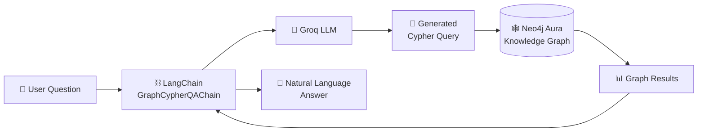
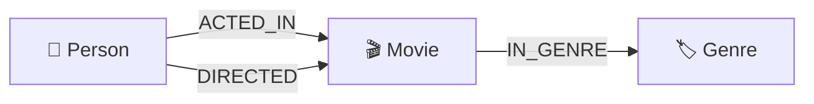

# 🎬 AI-Powered Movie Knowledge Graph

<p align="center">
  <strong>Natural Language Question Answering over a Movie Knowledge Graph using Neo4j Aura, LangChain, Cypher, and Groq</strong>
</p>

<p align="center">
  
  
  
  
  
</p>

---

## 📌 Overview

This project demonstrates an **AI-powered Movie Knowledge Graph Question Answering system** built with **Neo4j Aura**, **LangChain**, **Cypher**, and a **Groq-hosted Large Language Model**.

Movie-related data is represented as a connected graph, making it possible to explore relationships between entities such as movies, people, and genres.

The project combines graph database technology with a Large Language Model so that users can ask questions in natural language. The workflow interprets the question, generates an appropriate Cypher query, executes it against Neo4j, retrieves the relevant graph data, and returns a readable answer.

Instead of manually writing a Cypher query for every question, users can interact with the graph using natural language.

---

## ✨ Key Features

- 🕸️ Movie Knowledge Graph built with Neo4j
- ☁️ Cloud-hosted graph database using Neo4j Aura
- 🤖 Natural-language question answering
- 🔄 LLM-assisted natural language to Cypher generation
- 🧠 Groq-hosted Large Language Model integration
- ⛓️ LangChain `GraphCypherQAChain` workflow
- 🎬 Movie-domain graph modeling
- 🔗 Relationship-based graph traversal
- 📊 Interactive graph visualization in Neo4j Aura
- 📓 Jupyter Notebook implementation
- 🔍 Graph schema inspection
- ⚡ Cypher-powered graph querying

---

## 🏗️ System Architecture



### Workflow

```text
User Question
      │
      ▼
LangChain GraphCypherQAChain
      │
      ▼
Groq Large Language Model
      │
      ▼
Cypher Query Generation
      │
      ▼
Neo4j Aura Knowledge Graph
      │
      ▼
Graph Data Retrieval
      │
      ▼
Natural Language Answer
```

---

## 🕸️ Neo4j Knowledge Graph Visualization

The following visualization shows the connected movie knowledge graph queried inside **Neo4j Aura**.

The graph demonstrates how movie-domain entities are connected through relationships and can be explored using Cypher queries.

### Cypher Query

```cypher
MATCH (n)-[r]->(m)
RETURN n, r, m
```

### Graph Output

<p align="center">
  
</p>

<p align="center">
  <em>Connected movie knowledge graph visualized in Neo4j Aura.</em>
</p>

> The graph view provides a visual representation of nodes and relationships stored in the Neo4j database.

---

## 🧩 Knowledge Graph Concept

Unlike a traditional relational database that primarily organizes information into rows and tables, Neo4j represents data using:

- **Nodes** — entities in the domain
- **Relationships** — connections between entities
- **Properties** — attributes stored on nodes and relationships

A simplified movie graph can be represented as:



This graph-oriented structure is useful for exploring connected data and relationship-heavy questions.

---

## 🛠️ Technology Stack

| Technology | Purpose |
|---|---|
| Python | Core programming language |
| Jupyter Notebook | Interactive development and experimentation |
| Neo4j Aura | Cloud-hosted graph database |
| Cypher | Graph query language |
| LangChain | LLM application orchestration |
| GraphCypherQAChain | Natural language and graph query workflow |
| Groq | LLM inference provider |
| ChatGroq | LangChain integration for Groq-hosted models |

---

## 📁 Project Structure

A clean repository structure for this project is:

```text
movie-knowledge-graph/
│
├── README.md
├── requirements.txt
├── .gitignore
├── .env.example
│
├── notebooks/
│   └── movie_graph_qa.ipynb
│
├── assets/
│   └── neo4j-graph-visualization.png
│
└── cypher/
    └── analysis_queries.cypher
```

> The exact repository structure can be adjusted depending on how the notebook and supporting files are organized.

---

## ⚙️ Prerequisites

Before running the project, ensure that you have:

- Python 3.10 or later
- Jupyter Notebook or JupyterLab
- A Neo4j Aura instance
- Neo4j database credentials
- A Groq API key
- Git

---

## 🚀 Installation

### 1. Clone the Repository

Clone this repository from GitHub and enter the project directory:

```bash
git clone <your-repository-url>
cd <your-repository-folder>
```

### 2. Create a Virtual Environment

#### Windows

```bash
python -m venv venv
venv\Scripts\activate
```

#### Linux / macOS

```bash
python3 -m venv venv
source venv/bin/activate
```

### 3. Install Dependencies

If a `requirements.txt` file is included:

```bash
pip install -r requirements.txt
```

Alternatively, install the main project dependencies:

```bash
pip install jupyter neo4j langchain langchain-community langchain-groq langchain-experimental python-dotenv
```

---

## 📦 Dependencies

A typical `requirements.txt` for this project can include:

```txt
jupyter
neo4j
langchain
langchain-community
langchain-groq
langchain-experimental
python-dotenv
```

> For reproducible environments, pin package versions after validating the working environment used by the notebook.

---

## 🔐 Environment Configuration

Create a `.env` file in the project root:

```env
NEO4J_URI=neo4j+s://your-instance.databases.neo4j.io
NEO4J_USERNAME=neo4j
NEO4J_PASSWORD=your_neo4j_password

GROQ_API_KEY=your_groq_api_key
```

### Safe `.env.example`

Commit an `.env.example` file containing only placeholders:

```env
NEO4J_URI=neo4j+s://your-instance.databases.neo4j.io
NEO4J_USERNAME=neo4j
NEO4J_PASSWORD=your_password

GROQ_API_KEY=your_groq_api_key
```

> ⚠️ **Never commit real database credentials, passwords, tokens, or API keys to GitHub.**

---

## 🔒 Recommended `.gitignore`

Create a `.gitignore` file:

```gitignore
# Environment variables
.env

# Virtual environments
venv/
.venv/
env/

# Python
__pycache__/
*.py[cod]
*.pyo
*.pyd

# Jupyter
.ipynb_checkpoints/

# IDE
.vscode/
.idea/

# Operating system
.DS_Store
Thumbs.db
```

---

## 🔌 Connect to Neo4j

The Neo4j graph connection can be initialized using LangChain:

```python
import os

from langchain_community.graphs import Neo4jGraph

graph = Neo4jGraph(
    url=os.environ["NEO4J_URI"],
    username=os.environ["NEO4J_USERNAME"],
    password=os.environ["NEO4J_PASSWORD"]
)
```

Inspect the graph schema:

```python
print(graph.schema)
```

If the graph changes during execution, refresh the schema:

```python
graph.refresh_schema()
print(graph.schema)
```

---

## 🧠 Configure the Groq LLM

Initialize the Groq-hosted language model:

```python
import os

from langchain_groq import ChatGroq

llm = ChatGroq(
    groq_api_key=os.environ["GROQ_API_KEY"],
    model_name="llama-3.3-70b-versatile"
)
```

> Model availability can change. If the configured model is unavailable, select a currently supported Groq model.

---

## ⛓️ Create the Graph QA Chain

Create the LangChain graph question-answering workflow:

```python
from langchain_community.chains.graph_qa.cypher import GraphCypherQAChain

chain = GraphCypherQAChain.from_llm(
    llm=llm,
    graph=graph,
    verbose=True,
    allow_dangerous_requests=True
)
```

The chain connects the language model with the Neo4j graph database.

At a high level, it can:

1. Receive a natural-language question
2. Inspect the graph schema
3. Generate a Cypher query
4. Execute the query against Neo4j
5. Retrieve matching graph data
6. Produce a readable response

---

## 💬 Ask Questions in Natural Language

### Example 1 — Director Query

```python
response = chain.invoke({
    "query": "Who directed GoldenEye?"
})

print(response)
```

### Example 2 — Actor Query

```python
response = chain.invoke({
    "query": "Which actors played in Casino?"
})

print(response)
```

### Example 3 — Genre Query

```python
response = chain.invoke({
    "query": "What are the genres of Braveheart?"
})

print(response)
```

### Example 4 — Rating Query

```python
response = chain.invoke({
    "query": "List movies with IMDb rating greater than 8.5"
})

print(response)
```

> Actual answers depend on the nodes, properties, relationships, and records available in the connected Neo4j database.

---

## 🔄 Natural Language to Cypher Workflow

Suppose the user asks:

```text
Who directed GoldenEye?
```

The graph QA workflow can generate a Cypher query based on the actual Neo4j schema.

A conceptual query may look like:

```cypher
MATCH (p:Person)-[:DIRECTED]->(m:Movie)
WHERE m.title = "GoldenEye"
RETURN p.name
```

The complete flow is:

```text
"Who directed GoldenEye?"
              │
              ▼
      Question Interpretation
              │
              ▼
      Graph Schema Context
              │
              ▼
       Cypher Generation
              │
              ▼
       Neo4j Execution
              │
              ▼
       Matching Graph Data
              │
              ▼
     Human-Readable Response
```

> The exact generated Cypher depends on the graph schema and the LLM output.

---

## 🔍 Useful Cypher Queries

### View Connected Graph Data

```cypher
MATCH (n)-[r]->(m)
RETURN n, r, m
```

### Count All Nodes

```cypher
MATCH (n)
RETURN count(n) AS total_nodes
```

### Count All Relationships

```cypher
MATCH ()-[r]->()
RETURN count(r) AS total_relationships
```

### Inspect Node Labels

```cypher
MATCH (n)
UNWIND labels(n) AS label
RETURN label, count(*) AS total
ORDER BY total DESC
```

### Inspect Relationship Types

```cypher
MATCH ()-[r]->()
RETURN type(r) AS relationship_type,
       count(*) AS total
ORDER BY total DESC
```

### View Movie Nodes

```cypher
MATCH (m:Movie)
RETURN m
LIMIT 25
```

### Search for a Movie

```cypher
MATCH (m:Movie)
WHERE m.title = "Casino"
RETURN m
```

### Inspect a Limited Connected Subgraph

```cypher
MATCH (n)-[r]->(m)
RETURN n, r, m
LIMIT 100
```

---

## ▶️ Running the Project

Start Jupyter Notebook:

```bash
jupyter notebook
```

Then follow this workflow:

1. Open the project notebook
2. Run the dependency installation cells if required
3. Configure Neo4j credentials securely
4. Configure the Groq API key securely
5. Connect to Neo4j Aura
6. Load or verify graph data
7. Inspect the graph schema
8. Initialize the LLM
9. Create the `GraphCypherQAChain`
10. Ask natural-language questions
11. Inspect generated Cypher queries
12. Review the returned answers

---

## 📊 Project Output

The project demonstrates a connected graph database that can be visually explored and queried.

### Neo4j Aura Graph Result

```cypher
MATCH (n)-[r]->(m)
RETURN n, r, m
```

<p align="center">
  
</p>

<p align="center">
  <em>Graph visualization generated from the connected Neo4j Aura database.</em>
</p>

The visualization highlights the relationship-oriented structure of the dataset and provides a visual view of the connected graph.

---

## 🎯 Example Use Cases

This project demonstrates concepts applicable to:

- 🎬 Movie knowledge systems
- 🔎 Graph-based information retrieval
- 🤖 AI-powered database assistants
- 💬 Natural-language database querying
- 🕸️ Knowledge graph exploration
- 🧠 LLM and graph database integration
- 📊 Connected-data analysis
- 🔄 Text-to-Cypher workflows
- 📚 Educational graph database projects
- 🧩 GraphRAG experimentation

---

## 🔐 Security Considerations

This project uses:

```python
allow_dangerous_requests=True
```

This setting should be handled carefully because an LLM-generated query workflow can potentially produce unintended database operations.

For production environments:

- Use a dedicated Neo4j account
- Prefer read-only database permissions
- Apply least-privilege access
- Validate generated Cypher queries
- Restrict destructive operations
- Never expose database credentials
- Never commit API keys
- Add query allowlists where appropriate
- Review LLM-generated database operations
- Separate development and production databases

> ⚠️ Do not provide unrestricted production database access to an LLM-powered query chain.

---

## 🧪 Troubleshooting

### Neo4j Connection Error

Verify these environment variables:

```env
NEO4J_URI
NEO4J_USERNAME
NEO4J_PASSWORD
```

For Neo4j Aura, use the connection URI associated with the database instance.

---

### Groq Authentication Error

Verify:

```env
GROQ_API_KEY
```

Ensure that the API key is valid and correctly loaded into the environment.

---

### Empty Graph Results

Check whether the database contains nodes:

```cypher
MATCH (n)
RETURN count(n) AS total_nodes
```

If the result is `0`, the connected database currently contains no nodes.

---

### No Relationships Returned

Check:

```cypher
MATCH ()-[r]->()
RETURN count(r) AS total_relationships
```

If the result is `0`, nodes may exist without relationships.

---

### Schema Not Updated

Refresh the graph schema:

```python
graph.refresh_schema()
```

Then inspect it:

```python
print(graph.schema)
```

---

### Incorrect AI-Generated Cypher

Use verbose mode:

```python
chain = GraphCypherQAChain.from_llm(
    llm=llm,
    graph=graph,
    verbose=True,
    allow_dangerous_requests=True
)
```

Verbose output can help inspect generated Cypher and debug unexpected results.

---

### Query Returns Too Much Data

Instead of:

```cypher
MATCH (n)-[r]->(m)
RETURN n, r, m
```

use:

```cypher
MATCH (n)-[r]->(m)
RETURN n, r, m
LIMIT 100
```

This is easier to inspect during development.

---

## ⚠️ Limitations

Current limitations include:

- Answer quality depends on the selected LLM
- Generated Cypher may occasionally be incorrect
- Results depend on the available graph data
- Graph schema quality affects query generation
- LLM API access requires network connectivity
- Neo4j Aura connectivity is required for the cloud setup
- Large graph visualizations can become visually dense
- Dynamic query generation requires careful security controls
- The notebook is primarily an experimental and educational workflow rather than a production deployment

---

## 🔁 Reproducibility Notes

For more reproducible results:

- Pin dependency versions
- Keep secrets outside the notebook
- Use `.env` for local configuration
- Document the graph-loading process
- Preserve Cypher scripts used to create the graph
- Record the model name used for experiments
- Keep a consistent Neo4j schema
- Avoid committing notebook cells containing credentials
- Restart and run the notebook from top to bottom before publishing

---

## 🚀 Future Improvements

Potential future enhancements include:

- 💻 Streamlit chat interface
- ⚡ FastAPI backend
- 🧠 Conversation memory
- 🔎 Semantic search
- 📐 Vector embeddings
- 🕸️ Hybrid GraphRAG architecture
- 🛡️ Cypher validation layer
- 🔐 Read-only production database access
- 🐳 Docker support
- 🧪 Automated testing
- 🔄 CI/CD pipeline
- 🎬 Expanded movie datasets
- 📊 Advanced graph analytics
- 🎯 Recommendation engine
- 📈 Query evaluation metrics
- 📝 Structured logging
- 🌐 Web-based user interface

---

## 🤝 Contributing

Contributions are welcome.

### Contribution Workflow

1. Fork the repository
2. Create a feature branch

```bash
git checkout -b feature/new-feature
```

3. Make your changes

4. Commit the changes

```bash
git commit -m "feat: add new feature"
```

5. Push the branch

```bash
git push origin feature/new-feature
```

6. Open a Pull Request

When contributing:

- Keep code readable
- Do not commit credentials
- Document major changes
- Test notebook cells before submitting
- Keep changes focused
- Explain the purpose of the Pull Request

---

## 📄 License

No open-source license is assumed by this README.

If this repository is intended for public reuse, modification, or redistribution, add an appropriate `LICENSE` file based on the project's requirements.

Common choices include:

- MIT License
- Apache License 2.0
- GNU GPL v3

---

## 🙌 Acknowledgements

This project is built using technologies and concepts from:

- Neo4j
- Neo4j Aura
- LangChain
- Groq
- Python
- Jupyter Notebook
- Cypher Query Language

---

## ⭐ Support

If you find this project useful:

- ⭐ Star the repository
- 🍴 Fork the project
- 🐛 Open an issue
- 🚀 Contribute improvements

---

<p align="center">
  <strong>🎬 Built with Neo4j, LangChain, Groq, Cypher, and Python</strong>
</p>

<p align="center">
  <em>Exploring the intersection of Knowledge Graphs and Large Language Models.</em>
</p>
